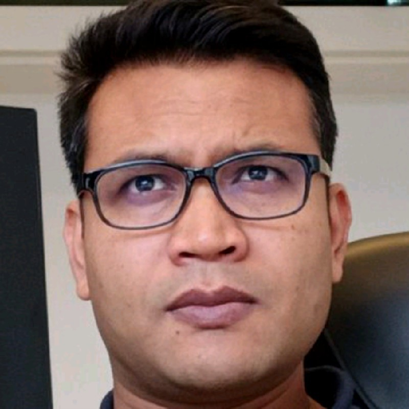

## About Me!

 I'm a Sr. Data Scientist at Fraunhofer FIT and Postdoc at RWTH Aachen University. I did my PhD in Computer Science from RWTH Aachen University, Germany under the supervision of <b>Prof. Stefan Decker</b>, with distinction (Summan Cum Laude)! 

I received a best paper award at 9th IEEE International Conference on Data Science & Advanced Analytics (DSAA), Sydney, Australia, 2020. I also won prestigious RWTH Aachen University <b>ICT Young Researcher Award</b> in 2020, for my significant contributions to ICT-related research. 

- I'm a technology lover. I love applied machine learning and explainable AI (XAI). 
- I love learning, mentoring, and coding! 
- I wrote several machine learning [books](https://www.amazon.com/s?k=Md.+Rezaul+Karim&ref=nb_sb_noss) too.
- I loving sharing my codes on GitHub! 

### Disclaimers: 
Opinions are mine, not my employer's! 

### Research interests

- Data science 
- Deep learning
- Explainable AI
- Knowledge graphs 
- Bioinformatics
- Applied machine learning. 

### Academic background

#### PhD, RWTH Aachen University, Germany [2017-2021]
- **Thesis title**: Interpreting Black-Box Machine Learning Models with Evidence-based Decision Rules and Knowledge Graph Reasoning
- **Supervisor**: Prof. Dr. Stefan Decker and Prof. Dr. Dietrich Rebholz-Schuhmann
- **Dissertation grade**: Summa Cum Laude.

### Master of Engineering, Kyung Hee University, Korea [2010-2012]
- **Major**: Data mining and knowledge discovery with minor in AI and cryptography
- **Master thesis title**: Privacy Preserving Mining Maximal Frequent Patterns
- **Fial grade**: 4.038/4.30 (Summa Cum Laude)

### Bachelor, University of Dhaka, Bangladesh [2004-2008]
- **Major**: Computer Science with minor in mathematics and statistics.
- **Final grade**: First class honours.

## How to reach me?
I'm always open for potential research and freelance opportunities: 

- **Email**: [rezaul.karim.fit@gmail.com](rezaul.karim.fit@gmail.com)
- **LinkedIn**: [https://www.linkedin.com/in/karimrwth/](https://www.linkedin.com/in/karimrwth/)
- **GitHub**: [https://github.com/rezacsedu](https://github.com/rezacsedu)
